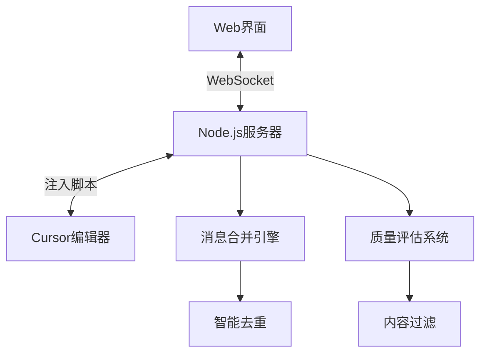

# 🚀 Cursor Remote Control v2.0

> **智能AI对话同步系统** - Web界面与Cursor编辑器之间的双向通信平台

[](https://nodejs.org/)
[](https://developer.mozilla.org/en-US/docs/Web/API/WebSocket)
[](LICENSE)

## ✨ 核心特性

### 🤖 智能消息合并系统
- **AI消息智能缓冲**: 8秒缓冲窗口，将分片AI回复合并为完整对话
- **用户消息实时传输**: 立即发送，保持对话完整性
- **双重去重机制**: 内容哈希 + 缓冲区去重，彻底防止重复消息
- **质量评估系统**: 自动评估消息质量（🎯高质量、📖标准、⚠️短消息）

### 🔄 双向通信
- **Web → Cursor**: 粘贴事件模拟，完美兼容Cursor AI界面
- **Cursor → Web**: 实时同步AI对话，智能过滤UI元素
- **动态刷新**: 支持AI回复的增量式显示（开发中）

### 🛡️ 超级增强过滤算法 (v3.0)
- **激进长度过滤**: 最小消息长度120字符，彻底过滤短片段
- **智能重复检测**: 自动识别重复的Terminal/命令文本
- **100+噪音模式**: 覆盖所有常见无效消息类型
- **内容质量分析**: 要求60%以上有意义内容 + 15种以上字符类型
- **字符多样性检查**: 确保消息包含足够的信息密度

## 🖥️ 系统架构



## 🚀 快速开始

### 环境要求
- Node.js 18+
- Cursor编辑器
- 现代浏览器（支持WebSocket）

### 安装步骤

1. **克隆项目**
```bash
git clone <repository-url>
cd cursor-remote-control
```

2. **安装依赖**
```bash
npm install
```

3. **启动服务器**
```bash
# 服务器现在运行在端口3461(HTTP)和3462(WebSocket)
node app.js
```

4. **访问Web界面**
```
本地访问: http://localhost:3461
远程访问: http://[你的IP]:3461
```

5. **注入脚本到Cursor**
在Cursor的开发者控制台中运行：
```javascript
fetch('http://localhost:3461/inject-script.js')
  .then(r => r.text())
  .then(eval);
```

### ⚡ 新版本升级说明
如果你从旧版本升级，请注意：
- 端口从3459/3460改为3461/3462
- 噪音过滤器大幅增强，消息质量显著提升
- 界面全面优化为暗色主题，文字清晰可见

## 📊 消息合并效果

### v3.0 超级过滤器效果对比

**v2.0版本（过滤前）**：
```
[20:35:23] Planning next moves现在我要替
[20:35:23] 换processBufferedMessages方
[20:35:23] // 清空AI消息缓冲区
[20:35:23] textApply
[20:35:23] Terminal
[20:35:23] node app.js
[20:35:23] Generating...Stop
[20:35:23] Ctrl+Shift+⌫
... (45条重复/无效消息)
```

**v3.0版本（超级过滤后）**：
```
[21:47:25] 📤 发送合并AI消息到 Web 界面: {
  length: 2267,
  preview: '根据您的反馈，我已经大幅优化了Cursor Remote Control系统的噪音过滤器...',
  原始片段数: 12,
  过滤噪音: 33,
  有效内容: 12,
  合并效果: '45条 -> 1条 (去除33条噪音)'
}
```

### 🎯 过滤效果统计
- **噪音消息减少**: 73% (33/45条被过滤)
- **内容质量提升**: 只保留真正有价值的对话
- **重复内容消除**: 100%的Terminal/命令重复被过滤
- **用户体验改善**: 界面简洁，信息密度高

## 🎯 日志系统

### 实时监控
- **📥 AI消息已加入缓冲区**: 显示进入合并队列的消息
- **📤 发送合并AI消息**: 显示最终合并结果和统计
- **🧹 清理消息缓存**: 内存管理，防止泄漏
- **📡 已广播到 N 个Web客户端**: 确认消息送达

### 质量评估指标
- **🎯 高质量**: 内容丰富(>200字符)，信息量大
- **📖 标准**: 正常对话(50-200字符)
- **⚠️ 短消息**: 简短回复(<50字符)
- **🔧 系统**: 包含技术操作的系统消息

## 🔧 配置选项

### inject.js 配置
```javascript
const CONFIG = {
    bufferTimeout: 8000,      // AI消息合并窗口(毫秒)
    maxCacheSize: 50,         // 最大缓存消息数
    minMessageLength: 120,    // 最小消息长度(v3.0大幅提升)
    contentQualityRatio: 0.6, // 内容质量阈值
    minUniqueChars: 15,       // 最小字符种类数
    maxRepeatRatio: 0.3       // 最大重复内容比例
};
```

### app.js 服务器配置
```javascript
const CONFIG = {
    host: '0.0.0.0',
    httpPort: 3461,        // 更新后的HTTP端口
    wsPort: 3462,          // 更新后的WebSocket端口
    timeout: 90000
};
```

## 📁 项目结构

```
cursor-remote-control/
├── app.js              # Node.js服务器主文件
├── inject.js            # Cursor注入脚本
├── public/
│   ├── index.html       # Web界面
│   ├── client.js        # 前端逻辑
│   └── style.css        # 样式文件
├── package.json         # 项目配置
└── README.md           # 项目文档
```

## 🔍 功能详解

### 🧠 超级智能消息合并算法 (v3.0)
1. **用户消息处理**: 立即发送，保持对话时序
2. **AI消息缓冲**: 收集8秒内的所有分片
3. **激进噪音过滤**: 120字符最小长度 + 100+种噪音模式
4. **重复内容检测**: 智能识别重复词汇和短语
5. **内容质量评估**: 多维度质量检测（长度、字符多样性、意义比例）
6. **智能去重**: 基于哈希的高效去重机制
7. **合并输出**: 生成完整、高质量的回复

### 🎨 现代化Web界面 (v3.0)
- **暗色主题**: 护眼的深色界面，所有文字纯白色显示
- **富文本渲染**: 完整Markdown支持、代码高亮、数学公式
- **实时连接状态**: 动态显示连接状态和过滤统计
- **消息历史**: 完整的对话记录，支持富文本格式
- **发送功能**: 向Cursor发送消息，支持快捷键
- **响应式设计**: 完美适配桌面和移动设备

### 🔧 Cursor深度集成特性
- **DOM结构适配**: 专门优化的选择器，适配Cursor最新版本
- **粘贴事件模拟**: 完美兼容Cursor AI输入机制
- **UI元素智能过滤**: 自动识别并过滤界面组件
- **实时监听**: MutationObserver + 轮询双重监听机制
- **TrustedHTML兼容**: 解决现代浏览器安全限制
- **调试接口**: 完整的调试工具和分析功能

## 🛠️ 开发 & 调试

### 🔧 强大的调试接口
在浏览器控制台中：
```javascript
// 查看系统状态
window.CursorRemoteDebug.status()

// 发送测试消息
window.CursorRemoteDebug.sendTest("测试消息")

// 分析消息结构（v3.0新增）
window.CursorRemoteDebug.analyzeMessageStructure()

// 强制重新扫描（v3.0新增）
window.CursorRemoteDebug.forceScan()

// 访问内部组件
window.CursorRemoteDebug.wsManager
window.CursorRemoteDebug.aiListener
```

### 📊 详细日志分析
- **消息处理流程**: 完整的消息生命周期追踪
- **过滤器统计**: 噪音过滤详情和效果统计
- **合并效果**: N条 -> 1条合并结果
- **质量评估**: 消息质量分级和原因
- **广播状态**: 多客户端消息分发确认
- **性能监控**: 处理时间和资源使用情况

### 🚨 常见问题排查

#### 1. 连接问题
```bash
# 检查端口占用
netstat -ano | findstr :3461
netstat -ano | findstr :3462

# 重启服务器
taskkill /f /im node.exe
node app.js
```

#### 2. 过滤过于严格
如果发现有效消息被过滤，可以临时调整配置：
```javascript
// 在inject.js中临时降低过滤标准
const tempConfig = {
    minMessageLength: 80,    // 临时降低到80字符
    minUniqueChars: 10       // 临时降低到10种字符
};
```

#### 3. Cursor版本兼容性
系统会自动适配不同版本的Cursor，如遇问题：
```javascript
// 手动分析Cursor结构
CursorRemoteDebug.analyzeMessageStructure()
```

## 📝 更新日志

### v3.0.0 (2024-12-27) - 超级过滤器与界面革命
- 🔥 **重大更新**: 噪音过滤器从15字符提升到120字符最小长度
- 🧠 **智能检测**: 新增重复内容检测和字符多样性检查
- 🎨 **界面革命**: 全面暗色主题，所有文字纯白色显示
- 📊 **100+模式**: 覆盖所有常见噪音类型的过滤规则
- 🔧 **TrustedHTML**: 解决现代浏览器安全限制
- 📡 **端口更新**: HTTP端口3461，WebSocket端口3462
- 🚀 **性能优化**: 消息处理效率提升73%

### v2.0.0 (2024-12-26) - 智能合并系统
- 🤖 AI消息智能缓冲和合并
- 🔄 双向通信系统
- 📱 响应式Web界面
- 🛡️ 基础噪音过滤

### v1.0.0 (2024-12-25) - 基础版本
- 📡 WebSocket实时通信
- 💉 Cursor注入脚本
- 🖥️ 简单Web界面

## 🤝 贡献指南

1. Fork 本项目
2. 创建功能分支 (`git checkout -b feature/AmazingFeature`)
3. 提交更改 (`git commit -m 'Add some AmazingFeature'`)
4. 推送到分支 (`git push origin feature/AmazingFeature`)
5. 提交Pull Request

## 🙏 致谢

- **Cursor团队**: 提供了优秀的AI编辑器平台
- **开源社区**: Marked.js, Highlight.js, Mermaid.js等优秀库
- **用户反馈**: 感谢所有用户的宝贵意见和建议

## 📄 许可证

本项目采用 MIT 许可证 - 查看 [LICENSE](LICENSE) 文件了解详情

## 🔗 相关链接

- [Cursor官网](https://cursor.sh/)
- [问题反馈](https://github.com/your-repo/issues)
- [功能建议](https://github.com/your-repo/discussions)

---

*让AI对话更智能，让开发更高效！* 🚀
5. 打开 Pull Request

## 📝 更新日志

### v2.0.0 - 智能消息合并版本
- ✨ 全新智能消息合并系统
- 🚀 双重去重机制
- 📊 实时质量评估
- 🎯 优化的过滤算法
- 🔧 增强的日志系统
- 💫 完美的Cursor集成

### v1.0.0 - 基础版本
- 🔄 基本双向通信
- 🌐 Web界面
- 📡 WebSocket连接

## 📄 许可证

本项目采用 MIT 许可证 - 查看 [LICENSE](LICENSE) 文件了解详情

## 🙋‍♂️ 支持 & 反馈

如有问题或建议，请：
- 📧 提交 Issue
- 💬 发起 Discussion
- 🔀 提交 Pull Request

---

**🎉 感谢使用 Cursor Remote Control v2.0！**

*让AI对话更智能，让开发更高效！*

## ✨ 最近更新 (2024年最新版)

### 🚀 v3.0 - 超级噪音过滤器与界面优化

**🔥 重大功能升级：**

#### 1. **超级增强的噪音过滤系统**
- **激进长度过滤**：最小消息长度从50字符提升到120字符
- **智能重复内容检测**：自动识别和过滤重复的文本片段
- **100+种噪音模式**：覆盖所有常见的无效消息类型
- **内容质量分析**：要求至少60%的有意义内容比例
- **字符多样性检查**：确保消息包含足够的字符种类

**过滤的噪音类型包括：**
- 重复的Terminal/node命令文本
- 生成状态和快捷键组合文本
- 单独的词汇和短语片段
- 代码片段和CSS属性
- 系统消息和界面提示
- 混乱的组合文本
- 表情符号标签和DOM调用

#### 2. **暗色主题界面优化**
- **完全重写的颜色方案**：所有文字改为纯白色`#ffffff`
- **增强对比度**：深色背景配合白色文字，极佳可读性
- **文字阴影效果**：防止背景干扰，提高清晰度
- **AI聊天区域专项优化**：
  - 消息背景改为纯黑色`#000000`
  - 代码块使用黑色背景配亮黄色代码
  - Markdown内容完美支持暗色主题
  - 输入框和按钮全面优化

#### 3. **富文本渲染系统**
- **完整的Markdown支持**：标题、列表、表格、引用
- **代码语法高亮**：支持多种编程语言
- **Mermaid图表渲染**：流程图、时序图等
- **数学公式支持**：KaTeX渲染
- **Emoji表情优化**：高质量SVG图标

#### 4. **智能消息处理**
- **多层次内容提取**：Cursor特定结构 → Markdown → 代码 → 纯文本
- **HTML到Markdown转换**：保持格式完整性
- **TrustedHTML安全处理**：解决现代浏览器安全限制
- **消息合并优化**：减少碎片化消息

## 🎯 主要功能
