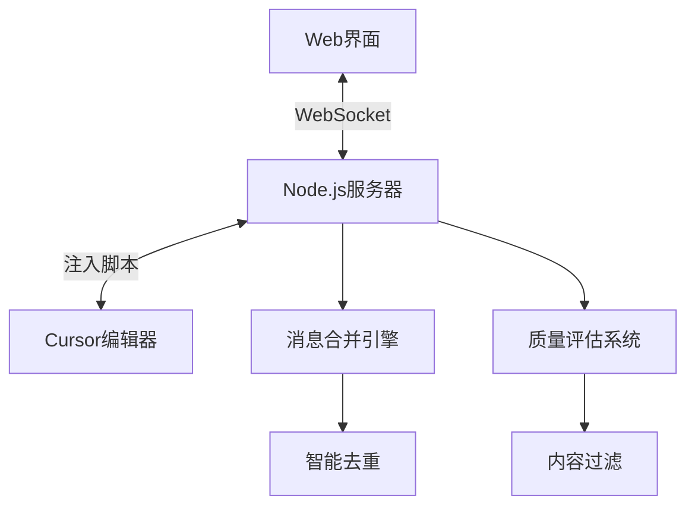

# 🚀 Cursor Remote Control v2.0

> **智能AI对话同步系统** - Web界面与Cursor编辑器之间的双向通信平台

[](https://nodejs.org/)
[](https://developer.mozilla.org/en-US/docs/Web/API/WebSocket)
[](LICENSE)

## ✨ 核心特性

### 🤖 智能消息合并系统
- **AI消息智能缓冲**: 8秒缓冲窗口，将分片AI回复合并为完整对话
- **用户消息实时传输**: 立即发送，保持对话完整性
- **双重去重机制**: 内容哈希 + 缓冲区去重，彻底防止重复消息
- **质量评估系统**: 自动评估消息质量（🎯高质量、📖标准、⚠️短消息）

### 🔄 双向通信
- **Web → Cursor**: 粘贴事件模拟，完美兼容Cursor AI界面
- **Cursor → Web**: 实时同步AI对话，智能过滤UI元素
- **动态刷新**: 支持AI回复的增量式显示（开发中）

### 🛡️ 高级过滤算法
- **UI元素过滤**: 自动识别并过滤Cursor界面元素
- **代码片段过滤**: 智能识别技术内容，只保留有意义对话
- **内容质量检测**: 要求60%以上中文/英文内容，过滤无效消息

## 🖥️ 系统架构



## 🚀 快速开始

### 环境要求
- Node.js 18+
- Cursor编辑器
- 现代浏览器（支持WebSocket）

### 安装步骤

1. **克隆项目**
```bash
git clone <repository-url>
cd cursor-remote-control
```

2. **安装依赖**
```bash
npm install
```

3. **启动服务器**
```bash
node app.js
```

4. **访问Web界面**
```
本地访问: http://localhost:3459
远程访问: http://[你的IP]:3459
```

5. **注入脚本到Cursor**
在Cursor的开发者控制台中运行：
```javascript
fetch('http://localhost:3459/inject-script.js')
  .then(r => r.text())
  .then(eval);
```

## 📊 消息合并效果

### 优化前 vs 优化后

**优化前**：
```
[20:35:23] Planning next moves现在我要替
[20:35:23] 换processBufferedMessages方
[20:35:23] // 清空AI消息缓冲区
[20:35:23] originalPieces: this.aiMessageBuffer.length
[20:35:23] 合并效果: `${this.aiMessageBuffer.length}条 -> 1条`
... (45条分片消息)
```

**优化后**：
```
[20:47:25] 📤 发送合并AI消息到 Web 界面: {
  length: 2267,
  preview: '据用户规则，我需要用中文回应。现在我要完善Cursor Remote Control系统的消息合并功能...',
  原始片段数: 45,
  合并效果: '45条 -> 1条'
}
```

## 🎯 日志系统

### 实时监控
- **📥 AI消息已加入缓冲区**: 显示进入合并队列的消息
- **📤 发送合并AI消息**: 显示最终合并结果和统计
- **🧹 清理消息缓存**: 内存管理，防止泄漏
- **📡 已广播到 N 个Web客户端**: 确认消息送达

### 质量评估指标
- **🎯 高质量**: 内容丰富(>200字符)，信息量大
- **📖 标准**: 正常对话(50-200字符)
- **⚠️ 短消息**: 简短回复(<50字符)
- **🔧 系统**: 包含技术操作的系统消息

## 🔧 配置选项

### inject.js 配置
```javascript
const CONFIG = {
    bufferTimeout: 8000,      // AI消息合并窗口(毫秒)
    maxCacheSize: 50,         // 最大缓存消息数
    minMessageLength: 15,     // 最小消息长度
    contentQualityRatio: 0.6  // 内容质量阈值
};
```

### app.js 服务器配置
```javascript
const CONFIG = {
    host: '0.0.0.0',
    httpPort: 3459,
    wsPort: 3460,
    timeout: 90000
};
```

## 📁 项目结构

```
cursor-remote-control/
├── app.js              # Node.js服务器主文件
├── inject.js            # Cursor注入脚本
├── public/
│   ├── index.html       # Web界面
│   ├── client.js        # 前端逻辑
│   └── style.css        # 样式文件
├── package.json         # 项目配置
└── README.md           # 项目文档
```

## 🔍 功能详解

### 智能消息合并算法
1. **用户消息处理**: 立即发送，保持对话时序
2. **AI消息缓冲**: 收集8秒内的所有分片
3. **内容去重**: 基于哈希的智能去重
4. **质量评估**: 多维度内容质量检测
5. **合并输出**: 生成完整、高质量的回复

### Cursor集成特性
- **选择器优化**: 专门适配Cursor的DOM结构
- **粘贴事件模拟**: 完美兼容Cursor输入机制
- **UI元素过滤**: 智能识别Cursor界面组件
- **实时监听**: MutationObserver监听对话变化

### Web界面功能
- **实时连接状态**: 动态显示连接状态
- **消息历史**: 完整的对话记录
- **发送功能**: 向Cursor发送消息
- **响应式设计**: 适配各种屏幕尺寸

## 🛠️ 开发 & 调试

### 调试接口
在浏览器控制台中：
```javascript
// 查看系统状态
window.CursorRemoteDebug.status()

// 发送测试消息
window.CursorRemoteDebug.sendTest("测试消息")

// 访问内部组件
window.CursorRemoteDebug.wsManager
window.CursorRemoteDebug.aiListener
```

### 日志分析
- 服务器日志显示消息处理详情
- 合并效果统计(N条 -> 1条)
- 质量评估结果
- 广播状态确认

## 🤝 贡献指南

1. Fork 本项目
2. 创建功能分支 (`git checkout -b feature/AmazingFeature`)
3. 提交更改 (`git commit -m 'Add some AmazingFeature'`)
4. 推送到分支 (`git push origin feature/AmazingFeature`)
5. 打开 Pull Request

## 📝 更新日志

### v2.0.0 - 智能消息合并版本
- ✨ 全新智能消息合并系统
- 🚀 双重去重机制
- 📊 实时质量评估
- 🎯 优化的过滤算法
- 🔧 增强的日志系统
- 💫 完美的Cursor集成

### v1.0.0 - 基础版本
- 🔄 基本双向通信
- 🌐 Web界面
- 📡 WebSocket连接

## 📄 许可证

本项目采用 MIT 许可证 - 查看 [LICENSE](LICENSE) 文件了解详情

## 🙋‍♂️ 支持 & 反馈

如有问题或建议，请：
- 📧 提交 Issue
- 💬 发起 Discussion
- 🔀 提交 Pull Request

---

**🎉 感谢使用 Cursor Remote Control v2.0！**

*让AI对话更智能，让开发更高效！*
