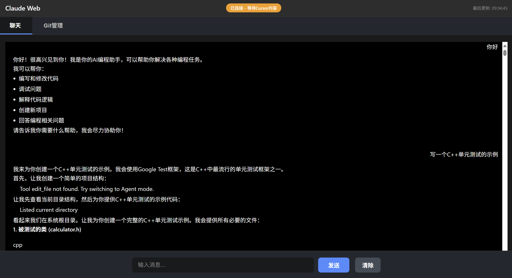

# Cursor Web - Cursor AI 远程控制平台

[](https://nodejs.org/)
[](https://opensource.org/licenses/MIT)

一个强大的 Web 界面远程控制平台，让您可以通过浏览器远程操作 Cursor 的 AI 聊天功能，同时提供 Git 仓库管理、实时消息同步等高级功能。



## ✨ 主要功能

### 🤖 AI 聊天控制
- **实时消息同步** - Cursor ↔ Web 双向消息同步
- **远程对话** - 通过 Web 界面与 Cursor AI 进行对话
- **消息历史** - 完整的对话历史记录和搜索
- **格式化显示** - 支持代码高亮和 Markdown 渲染

### 🔧 Git 仓库管理
- **分支管理** - 查看和切换 Git 分支
- **代码同步** - 一键拉取最新代码
- **状态监控** - 实时显示仓库状态
- **操作日志** - 完整的 Git 操作记录

### 🌐 Web 界面
- **响应式设计** - 支持桌面和移动设备
- **实时状态** - WebSocket 连接状态监控
- **多标签页** - 聊天、历史记录、Git 管理、系统诊断
- **现代化 UI** - 美观的用户界面

### ⚡ 技术特性
- **WebSocket 通信** - 实时双向数据传输
- **自动重连** - 网络中断自动恢复
- **跨域支持** - 完整的 CORS 配置
- **错误处理** - 完善的异常处理机制

## 🚀 快速开始

### 方式一：使用可执行文件（推荐）

1. **下载最新版本**
   - 请在本项目的 Releases 页面下载 `cursor-web.exe`

2. **运行程序**
   ```bash
   # 双击运行
   cursor-web.exe

   # 或在命令行运行
   ./cursor-web.exe
   ```

3. **访问 Web 界面**
   - 打开浏览器访问：`http://localhost:3000`
   - 查看服务器状态：`http://localhost:3000/api/health`

### 方式二：从源码运行

1. **克隆项目**
   ```bash
   git clone <你的仓库地址>
   cd <目录名>
   ```

2. **安装依赖**
   ```bash
   npm install
   ```

3. **启动服务**
   ```bash
   # 开发模式（自动重启）
   npm run dev

   # 生产模式
   npm start
   ```

4. **打包可执行文件**
   ```bash
   npm run package
   ```

## 📖 使用指南

### 连接 Cursor

1. **启动 Web 服务**
   - 确保服务运行在 `http://localhost:3000`

2. **打开 Cursor**
   - 启动 Cursor 编辑器
   - 打开 AI 聊天面板

3. **注入连接脚本**
   - 在 Cursor 中按 `F12` 打开开发者工具，切换到 `Console`
   - 打开 `http://localhost:3000/script.html`，一键复制同步脚本
   - 粘贴到 Console 并执行
   - 看到“✅ WebSocket 连接成功”表示连接成功

### 使用 AI 聊天

1. **发送消息**
   - 在 Web 界面"AI 助手"标签页输入消息
   - 点击发送按钮或按 `Ctrl+Enter`
   - 消息会自动同步到 Cursor

2. **接收回复**
   - Cursor 中的 AI 回复会自动同步到 Web 界面
   - 支持代码高亮和格式化显示

3. **管理对话**
   - 使用搜索功能查找历史消息
   - 清空对话重新开始
   - 查看消息时间戳和状态

### Git 仓库管理

1. **查看分支**
   - 在"Git 管理"标签页查看所有分支
   - 当前分支会高亮显示

2. **切换分支**
   - 选择目标分支
   - 点击"切换分支"按钮
   - 确认切换操作

3. **更新代码**
   - 点击"拉取代码"按钮
   - 自动从远程仓库拉取最新代码
   - 查看操作结果和日志

## 🔧 API 文档

### 服务器状态
```http
GET /api/health
GET /api/status
```
返回服务器健康状态、连接信息与运行统计

### 内容管理
```http
GET /api/content
POST /api/content
```
获取和设置当前聊天内容

### 聊天记录
```http
GET /api/chats
GET /api/chat/:sessionId
GET /api/chat/:sessionId/export?format=html|json
```
获取所有会话、单个会话详情，以及导出指定会话

### Git 操作
```http
GET /api/git/branches
POST /api/git/checkout
POST /api/git/pull
GET /api/git/status
POST /api/git/add
POST /api/git/commit
POST /api/git/push
```
Git 分支管理和代码同步

### 历史记录（高级）
```http
GET /api/history
GET /api/history/stats
GET /api/history/projects
GET /api/history/:id
GET /api/history/export?format=json|csv|html
```
历史记录检索、统计与导出

### WebSocket 事件
- `html_content` - 接收 HTML 内容
- `cursor_message` - Cursor 消息事件
- `web_message` - Web 消息事件
- `status_update` - 状态更新

## 🛠️ 开发指南

### 项目结构
```
Cursor-Web-2/
├── app.js                   # 主服务器入口
├── package.json             # 项目配置与脚本
├── public/                  # 前端静态资源
│   ├── index.html           # 主页面（内嵌历史记录 iframe）
│   ├── history-new.html     # 现代历史记录页面
│   ├── chat-detail.html     # 会话详情页
│   ├── diagnostic.html      # 系统诊断页
│   ├── script.html          # 一键复制同步脚本页
│   ├── style.css            # 样式
│   ├── git-manager.js       # Git 前端逻辑
│   ├── cursor-browser.js    # 浏览器桥接辅助
│   └── js/
│       ├── SimpleWebClient.js
│       └── modules/         # ContentManager / WebSocketManager 等模块
├── routes/                  # API 路由（content/git/history）
├── services/                # 业务模块（websocketManager / cursorHistoryManager* / sqliteReader 等）
├── middleware/              # 中间件
├── utils/                   # 工具函数
├── config/                  # 配置
├── tests/                   # 测试（unit / integration）
├── scripts/                 # 脚本
└── README.assets/           # 文档资源
```

### 开发环境
```bash
# 安装依赖
npm install

# 开发模式
npm run dev

# 运行测试
npm test                    # 运行所有测试
npm run test:unit          # 只运行单元测试
npm run test:integration   # 只运行集成测试

# 代码检查
npm run lint
```

### 构建部署
```bash
# 打包可执行文件
npm run package

# 生产环境启动
npm start
```

## 🧪 测试

项目包含完整的测试套件，分为单元测试和集成测试。

### 测试结构
```
tests/
├── unit/                    # 单元测试
│   ├── test-git.js         # Git基础功能测试
│   └── test-remote-branch.js # 远程分支功能测试
├── integration/             # 集成测试
│   ├── test-checkout.js     # 分支切换集成测试
│   └── test-dynamic-git.js  # 动态Git路径集成测试
├── run-all-tests.js         # 测试运行器
└── README.md               # 测试说明文档
```

### 运行测试

```bash
# 运行所有测试
npm test

# 只运行单元测试
npm run test:unit

# 只运行集成测试
npm run test:integration

# 使用测试运行器
node tests/run-all-tests.js --help
```

### 测试类型说明

#### 单元测试 (unit/)
- **test-git.js**: 测试 Git 基础功能，包括分支获取、状态检查等
- **test-remote-branch.js**: 测试远程分支相关功能

#### 集成测试 (integration/)
- **test-checkout.js**: 测试通过 HTTP API 进行分支切换的完整流程
- **test-dynamic-git.js**: 测试动态 Git 路径功能，包括健康检查、分支信息获取等

### 测试注意事项

1. **集成测试需要服务器运行**: 集成测试需要先启动 Web 服务器（默认端口 3000）
2. **Git 仓库要求**: 确保在 Git 仓库目录中运行测试
3. **依赖安装**: 确保已安装所有必要的 npm 依赖

### 快速测试
1. 启动服务：`npm start`
2. 访问：`http://localhost:3000`
3. 连接 Cursor 并测试双向同步
4. 测试 Git 管理功能

注：测试脚本以 `package.json` 中的命令为准

## 🤝 贡献指南

我们欢迎各种形式的贡献！请查看 [CONTRIBUTING.md](./CONTRIBUTING.md) 了解详情。

### 贡献方式
- 🐛 报告 Bug
- 💡 提出新功能
- 📝 改进文档
- 🔧 提交代码

## 📝 更新日志

详细的版本更新记录请查看 [CHANGELOG.md](./CHANGELOG.md)

## 📄 许可证

本项目采用 [MIT License](./LICENSE) 开源协议。

## 🆘 支持与帮助

### 常见问题

**Q: 无法连接到 Cursor？**
A: 确保 Cursor 正在运行，并且正确执行了注入脚本。

**Q: 消息同步失败？**
A: 检查 WebSocket 连接状态，尝试刷新页面重新连接。

**Q: Git 操作失败？**
A: 确保当前目录是有效的 Git 仓库，并且有相应的权限。

**Q: 测试运行失败？**
A: 确保在 Git 仓库目录中运行测试，集成测试需要先启动服务器。

**Q: 如何运行特定测试？**
A: 使用 `npm run test:unit` 运行单元测试，`npm run test:integration` 运行集成测试。

### 获取帮助
- 🐛 提交 Issue：请在项目仓库的 Issues 区发布
- 💬 问题反馈：欢迎在讨论区或提交 PR 交流

## ⭐ 致谢

感谢所有为这个项目做出贡献的开发者！

---

**Cursor Web** - 让 Cursor AI 控制更简单、更强大！ 🚀
